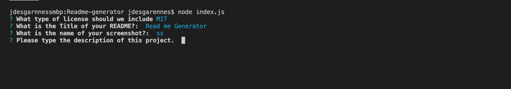

 

  # Title: Readme Generator

    
  
  ## Description: This project will automatically create a README.md file for the user. It Does this by asking as series of questions that all readme files need, and will will write them to the newly created readme file. 

  ## Usage:  First the user will run node index.js and will be presented with a inquirer driven series of cli questions. Then the user will fill them in one at a time. Some questions will require a text input, other questions are a choice selection. After all of the questions are awnsered, the program will give the user a notice from console.log stating that the README.md file creation was successful. The user can then upload thereadme file. 

  ## Questions: johndesgarennes@gmail.com

  ## Github username: jdesgarennes

  ## License type: GPL

 ## Table Of Contents
 [Title:](#Title)
 [Description:](#Description)
 [Usage:](#Usage)
 [Questions:](#Questions)

  